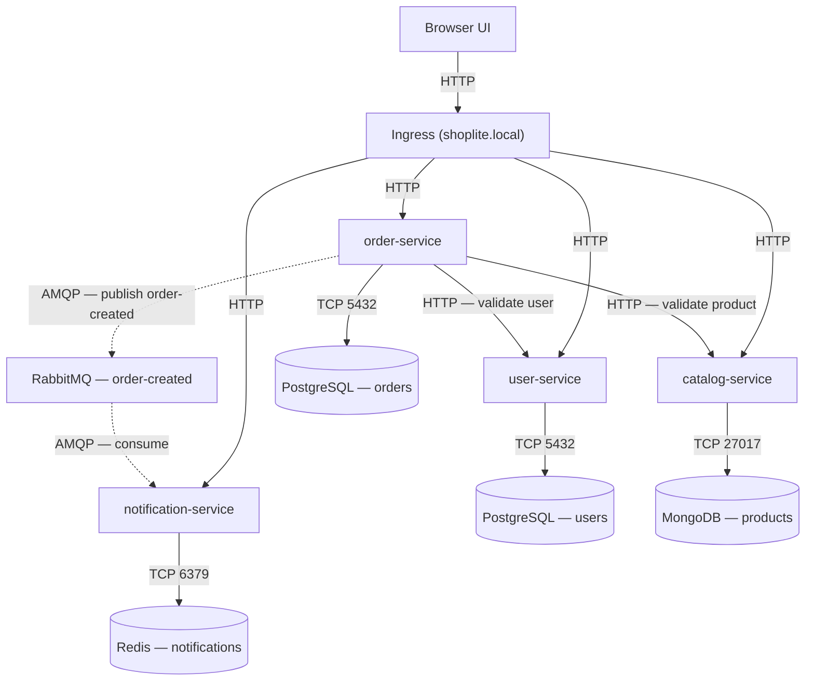

# ShopLite

ShopLite is a small microservices e-commerce reference application built for
the BJIT DevOps platform-engineering assignment. Four independent FastAPI
services — user, catalog, order, notification — each own a separate
database, talk to each other over REST for synchronous checks and RabbitMQ
for asynchronous notification delivery, and run either as a Docker Compose
stack locally or as a full Kubernetes deployment on `minikube`, provisioned
in part by Terraform.

## Architecture



Solid lines are synchronous (REST/TCP); dashed lines are asynchronous (AMQP).
`order-service` waits on the user and catalog checks because an order cannot
be accepted without them — it does not wait on notification delivery, so a
down `notification-service` never blocks an order.

## Prerequisites

| Tool | Version used |
|---|---|
| Docker Engine | 29.x |
| Docker Compose | v2 (bundled with Docker) |
| `kubectl` | v1.35 |
| `minikube` | v1.38 |
| `terraform` | v1.15 |
| Python | 3.12 (for local lint/test; services run 3.12 in containers regardless) |

> **Deviation from the assignment brief:** the brief specifies a `kind`
> cluster provisioned via Terraform's `tehcyx/kind` provider. This
> environment used `minikube` instead, since that was the tool already
> available. See `docs/design-decisions.md` for the full rationale,
> including the corresponding change to how the Terraform `platform` module
> installs ingress-nginx.

## Local run — Docker Compose

```bash
git clone git@github.com:MoshfekaMunia/shoplite-deploy.git
cd shoplite-deploy
cp .env.example .env
docker compose up --build
```

Wait for all nine containers to report healthy:

```bash
docker compose ps
```

Verify the four health endpoints:

```bash
curl http://localhost:8001/healthz   # user-service
curl http://localhost:8002/healthz   # catalog-service
curl http://localhost:8003/healthz   # order-service
curl http://localhost:8004/healthz   # notification-service
```

Expected output for each: `{"status":"ok"}`

## Kubernetes deployment — minikube

### 1. Provision the cluster and namespace with Terraform

```bash
cd terraform
terraform init
terraform apply
```

This starts minikube (`cluster` module) and creates the `shoplite`
namespace (`platform` module).

### 2. Build and load the four service images

minikube's Docker driver uses its own daemon, separate from the host, so
locally built images must be explicitly loaded:

```bash
cd ..
docker build -t shoplite/user-service:v1 ./services/user-service
docker build -t shoplite/catalog-service:v1 ./services/catalog-service
docker build -t shoplite/order-service:v1 ./services/order-service
docker build -t shoplite/notification-service:v1 ./services/notification-service

minikube image load shoplite/user-service:v1
minikube image load shoplite/catalog-service:v1
minikube image load shoplite/order-service:v1
minikube image load shoplite/notification-service:v1
```

Every Deployment sets `imagePullPolicy: IfNotPresent`. The default,
`Always`, would make Kubernetes try to pull each image from a public
registry on every pod start — these images only exist locally inside
minikube's Docker daemon, so `Always` would fail with `ImagePullBackOff`.
`IfNotPresent` tells Kubernetes to use the local copy it already has.

### 3. Apply the manifests

```bash
kubectl apply -f k8s/configmap.yaml
kubectl apply -f k8s/secret.yaml

kubectl apply -f k8s/data/user-db.yaml
kubectl apply -f k8s/data/order-db.yaml
kubectl apply -f k8s/data/catalog-db.yaml
kubectl apply -f k8s/data/notification-db.yaml
kubectl apply -f k8s/data/rabbitmq.yaml

kubectl wait --for=condition=Ready pod -l app=user-db -n shoplite --timeout=120s
kubectl wait --for=condition=Ready pod -l app=order-db -n shoplite --timeout=120s
kubectl wait --for=condition=Ready pod -l app=catalog-db -n shoplite --timeout=120s
kubectl wait --for=condition=Ready pod -l app=notification-db -n shoplite --timeout=120s
kubectl wait --for=condition=Ready pod -l app=rabbitmq -n shoplite --timeout=180s

kubectl apply -f k8s/services/user-service.yaml
kubectl apply -f k8s/services/catalog-service.yaml
kubectl apply -f k8s/services/order-service.yaml
kubectl apply -f k8s/services/notification-service.yaml

kubectl apply -f k8s/ingress.yaml
```

### 4. Add the hosts entry

```bash
echo "$(minikube ip) shoplite.local" | sudo tee -a /etc/hosts
```

Using `minikube ip` rather than `127.0.0.1` matters here: minikube's
`docker` driver runs the cluster inside its own container with its own IP,
unlike `kind`, which typically maps the ingress controller directly onto
`localhost`.

### 5. Verify

```bash
kubectl get pods -n shoplite
```

Expect 13 pods, all `Running`: 4 databases, RabbitMQ, and 4 application
services at 2 replicas each.

```bash
curl http://shoplite.local/api/users/1
curl http://shoplite.local/api/products
curl http://shoplite.local/api/orders/1
curl http://shoplite.local/api/notifications/1
```

Or open `http://shoplite.local` directly in a browser.

## Full demonstration

Create a user:

```bash
curl -X POST http://shoplite.local/api/users \
  -H "Content-Type: application/json" \
  -d '{"name":"Amina Rahman","email":"amina@example.com"}'
```

```json
{"id":1,"name":"Amina Rahman","email":"amina@example.com"}
```

Create a product:

```bash
curl -X POST http://shoplite.local/api/products \
  -H "Content-Type: application/json" \
  -d '{"name":"Mechanical keyboard","price":29.99,"attributes":{"layout":"US"}}'
```

```json
{"id":"6a75a22a7f71ac1fcf1a3eb8","name":"Mechanical keyboard","price":29.99,"attributes":{"layout":"US"}}
```

Create an order (using the product `id` returned above):

```bash
curl -X POST http://shoplite.local/api/orders \
  -H "Content-Type: application/json" \
  -d '{"userId":1,"productId":"6a75a22a7f71ac1fcf1a3eb8","quantity":2}'
```

```json
{"id":1,"userId":1,"productId":"6a75a22a7f71ac1fcf1a3eb8","quantity":2,"unitPrice":"29.99","total":"59.98","createdAt":"2026-08-07T09:16:00.669276Z","notificationQueued":true}
```

Read the notification that appeared:

```bash
curl http://shoplite.local/api/notifications/1
```

```json
[{"id":"58e4dc93-07d6-4788-a549-16e38b5c3f24","userId":1,"orderId":1,"message":"Your ShopLite order #1 was created.","createdAt":"2026-08-05T15:28:52.139182+00:00"}]
```

## Manual scaling demonstration

```bash
kubectl scale deployment order-service --replicas=5 -n shoplite
kubectl get pods -n shoplite -l app=order-service -w
```
deployment.apps/order-service scaled
NAME READY STATUS RESTARTS AGE
order-service-59b485fb6-c6bzj 0/1 ContainerCreating 0 1s
order-service-59b485fb6-dm7xk 0/1 ContainerCreating 0 1s
order-service-59b485fb6-lmvr4 1/1 Running 0 10m
order-service-59b485fb6-mjpb9 0/1 ContainerCreating 0 1s
order-service-59b485fb6-t6rph 1/1 Running 0 10m
order-service-59b485fb6-dm7xk 0/1 Running 0 1s
order-service-59b485fb6-mjpb9 0/1 Running 0 2s
order-service-59b485fb6-c6bzj 0/1 Running 0 2s
order-service-59b485fb6-mjpb9 1/1 Running 0 8s
order-service-59b485fb6-dm7xk 1/1 Running 0 8s
order-service-59b485fb6-c6bzj 1/1 Running 0 9s

**What happens to traffic while new pods start:** the two pre-existing pods
keep serving requests unaffected throughout. Each new pod starts at `0/1` —
container running, but not yet passing its `readinessProbe`
(`GET /readyz`). Because the Service's selector only routes traffic to pods
that report ready, Kubernetes never sends a real request to a pod that
hasn't confirmed it can reach its database. Only once a pod flips to `1/1`
does it start receiving traffic — this is exactly why readiness and
liveness probes are kept separate.

## Resilience demonstration — database pod failure

```bash
kubectl get pods -n shoplite -l app=order-db
kubectl scale deployment order-db --replicas=0 -n shoplite
sleep 20
kubectl get pods -n shoplite -l app=order-service
kubectl scale deployment order-db --replicas=1 -n shoplite
kubectl get pods -n shoplite -l app=order-service -w
```
NAME READY STATUS RESTARTS AGE
order-db-7b96844c94-r5klv 1/1 Running 0 2m38s
deployment.apps/order-db scaled

NAME READY STATUS RESTARTS AGE
order-service-59b485fb6-c6bzj 0/1 Running 0 6m23s
order-service-59b485fb6-dm7xk 0/1 Running 0 6m23s
order-service-59b485fb6-lmvr4 0/1 Running 0 16m
order-service-59b485fb6-mjpb9 0/1 Running 0 6m23s
order-service-59b485fb6-t6rph 0/1 Running 0 16m
deployment.apps/order-db scaled

order-service-59b485fb6-t6rph 1/1 Running 0 16m
order-service-59b485fb6-lmvr4 1/1 Running 0 16m
order-service-59b485fb6-mjpb9 1/1 Running 0 6m28s
order-service-59b485fb6-dm7xk 1/1 Running 0 6m28s
order-service-59b485fb6-c6bzj 1/1 Running 0 6m29s

With `order-db` scaled to zero, all five `order-service` pods flip to
`READY: 0/1` — the readiness probe correctly detects the database is
unreachable and Kubernetes stops routing traffic to them. `RESTARTS` stays
at `0` and `STATUS` stays `Running` throughout: the liveness probe
(`GET /healthz`, which checks nothing but the process itself) never fails,
so Kubernetes never kills or restarts the containers. Once `order-db`
returns, every pod recovers to `1/1 Running` automatically, with no manual
intervention. This is the distinction the assignment brief calls out
directly: separating liveness from readiness prevents a database hiccup
from turning into a full outage via unnecessary restarts.

## Teardown

Kubernetes:

```bash
kubectl delete namespace shoplite  # removes all 13 app pods, PVCs, Secret, ConfigMap
cd terraform
terraform destroy                  # removes the shoplite namespace from Terraform state and deletes the minikube cluster
```

Docker Compose:

```bash
docker compose down --volumes      # --volumes also removes all persisted data
```

## Troubleshooting

Real issues hit while building this, in the order they came up:

1. **`CrashLoopBackOff` with a literal `$(VAR_NAME)` in a Postgres
   connection error.** Kubernetes' `$(VAR_NAME)` substitution inside a
   container's `env:` list only resolves variables declared *earlier in
   the same list*. The composed `DATABASE_URL` was originally declared
   before the individual `USER_DB_USER`/`PASSWORD`/`NAME` variables it
   referenced. Fix: reorder so source variables come first.

2. **A second `order-service` replica stuck `Pending` with `Insufficient
   cpu`.** The host VM only had 2 vCPUs allocated, and Kubernetes' own
   system pods plus the existing workloads had already claimed all of it.
   Fix: increased the VM's CPU allocation in VirtualBox, then recreated the
   minikube cluster with `--cpus=4` (minikube pins CPU/memory at cluster
   creation and won't change it on an existing cluster).

3. **Ingress returned a generic `{"detail":"Not Found"}` on every route.**
   An initial `rewrite-target` regex intended to strip the `/api` prefix
   was instead stripping the actual resource path (e.g. `/api/users/1`
   became `/1`), since the application already natively serves every
   route under both `/` and `/api`. Fix: removed the rewrite entirely and
   used a plain `pathType: Prefix` match.

4. **`terraform apply` failed with "namespace already exists."** The
   `shoplite` namespace had already been created manually via `kubectl`
   before Terraform managed it. Fix:
   `terraform import module.platform.kubernetes_namespace.app shoplite`.

5. **Local `pytest` failed with `ImportError: cannot import name 'UTC'
   from 'datetime'`**, even though the same code runs correctly in the
   actual containers. `order-service` uses `datetime.UTC`, added in Python
   3.11, but the local dev venv was created with the system's Python 3.10.
   The service's Dockerfile is correctly pinned to `python:3.12.11-slim`,
   and the CI workflow is pinned to Python 3.12 — this was purely a local
   environment mismatch, not a code defect.

